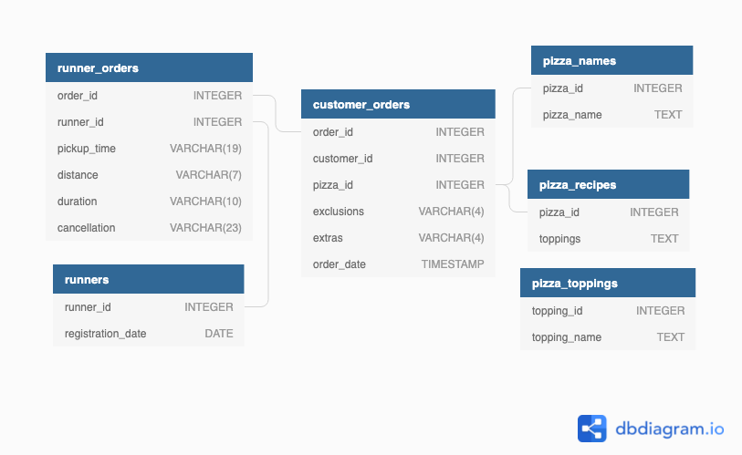

# Pizza Runner - Case Study


# Context
Did you know that over 115 million kilograms of pizza is consumed daily worldwide??? (Well according to Wikipedia anyway…)

Danny was scrolling through his Instagram feed when something really caught his eye - “80s Retro Styling and Pizza Is The Future!”

Danny was sold on the idea, but he knew that pizza alone was not going to help him get seed funding to expand his new Pizza Empire - so he had one more genius idea to combine with it - he was going to Uberize it - and so Pizza Runner was launched!

Danny started by recruiting “runners” to deliver fresh pizza from Pizza Runner Headquarters (otherwise known as Danny’s house) and also maxed out his credit card to pay freelance developers to build a mobile app to accept orders from customers.


#  Datasets
Because Danny had a few years of experience as a data scientist - he was very aware that data collection was going to be critical for his business’ growth.

He has prepared for us an entity relationship diagram of his database design but requires further assistance to clean his data and apply some basic calculations so he can better direct his runners and optimise Pizza Runner’s operations.



`runners` table

The runners table shows the registration_date for each new runner
| runner_id | registration_date |
|-----------|-------------------|
| 1         | 2021-01-01        |
| 2         | 2021-01-03        |
| 3         | 2021-01-08        |
| 4         | 2021-01-15        |

All of the required datasets for this case study reside within the pizza_runner  schema on the PostgreSQL Docker setup.

` customer_orders` table

Customer pizza orders are captured in the customer_orders table with 1 row for each individual pizza that is part of the order.

The pizza_id relates to the type of pizza which was ordered whilst the exclusions are the ingredient_id values which should be removed from the pizza and the extras are the ingredient_id values which need to be added to the pizza.

Note that customers can order multiple pizzas in a single order with varying exclusions and extras values even if the pizza is the same type!

The exclusions and extras columns will need to be cleaned up before using them in queries.

| order_id | customer_id | pizza_id | exclusions | extras | order_time          |
|----------|-------------|----------|------------|--------|---------------------|
| 1        | 101         | 1        |            |        | 2021-01-01 18:05:02 |
| 2        | 101         | 1        |            |        | 2021-01-01 19:00:52 |
| 3        | 102         | 1        |            |        | 2021-01-02 23:51:23 |
| 3        | 102         | 2        |            | NaN    | 2021-01-02 23:51:23 |
| 4        | 103         | 1        | 4          |        | 2021-01-04 13:23:46 |
| 4        | 103         | 1        | 4          |        | 2021-01-04 13:23:46 |
| 4        | 103         | 2        | 4          |        | 2021-01-04 13:23:46 |
| 5        | 104         | 1        | null       | 1      | 2021-01-08 21:00:29 |
| ...      | ...         | ...      | ...        | ...    | ...                 |

`runner_orders` table

After orders are received through the system - they are assigned to a runner - however not all orders are fully completed and can be cancelled by the restaurant or the customer.

The pickup_time is the timestamp at which the runner arrives at the Pizza Runner headquarters to pick up the freshly cooked pizzas. The distance and duration fields are related to how far and long the runner had to travel to deliver the order to the respective customer.

There are some known data issues with this table!
| order_id | runner_id | pickup_time         | distance | duration   | cancellation            |
|----------|-----------|---------------------|----------|------------|-------------------------|
| 1        | 1         | 2021-01-01 18:15:34 | 20km     | 32 minutes |                         |
| 2        | 1         | 2021-01-01 19:10:54 | 20km     | 27 minutes |                         |
| 3        | 1         | 2021-01-03 00:12:37 | 13.4km   | 20 mins    | NaN                     |
| 4        | 2         | 2021-01-04 13:53:03 | 23.4     | 40         | NaN                     |
| 5        | 3         | 2021-01-08 21:10:57 | 10       | 15         | NaN                     |
| 6        | 3         | null                | null     | null       | Restaurant Cancellation |
| 7        | 2         | 2020-01-08 21:30:45 | 25km     | 25mins     | null                    |
| ...      | ...       | ...                 | ...      | ...        | ...                     |

`pizza_names` table

At the moment - Pizza Runner only has 2 pizzas available the Meat Lovers or Vegetarian!

| pizza_id | pizza_name  |
|----------|-------------|
| 1        | Meat Lovers |
| 2        | Vegetarian  |

`pizza_recipes` table

Each pizza_id has a standard set of toppings which are used as part of the pizza recipe.

| pizza_id | toppings                |
|----------|-------------------------|
| 1        | 1, 2, 3, 4, 5, 6, 8, 10 |
| 2        | 4, 6, 7, 9, 11, 12      |

`pizza_toppings` table

This table contains all of the topping_name values with their corresponding topping_id value

| opping_id | topping_name |
|-----------|--------------|
| 1         | Bacon        |
| 2         | BBQ Sauce    |
| 3         | Beef         |
| 4         | Cheese       |
| 5         | Chicken      |
| 6         | Mushrooms    |
| 7         | Onions       |
| 8         | Pepperoni    |
| 9         | Peppers      |
| 10        | Salami       |
| 11        | Tomatoes     |
| 12        | Tomato Sauce |


# Case Study Questions
The questions of this case study are broken up by area of focus including: 
* Pizza Metrics 
* Runner and Customer Experience 
* Ingredient Optimisation 
* Pricing and Ratings 
* Bonus DML Challenges (DML = Data Manipulation Language)


Before starting with the SQL queries however - I want to investigate the data, and do something with some of those null values and data types in the customer_orders and runner_orders tables.

## Exploration
```sql
-- inspect data
SELECT 
   table_name, 
   column_name, 
   data_type 
FROM 
   information_schema.columns
WHERE 
   table_schema = 'pizza_runner'
ORDER BY table_name;

-- tables are small can inspect whole table
SELECT 
  *
FROM pizza_runner.customer_orders;

SELECT
  * 
FROM pizza_runner.pizza_names;

SELECT
  * 
FROM pizza_runner.pizza_recipes;

SELECT
  * 
FROM pizza_runner.pizza_toppings;

SELECT
  * 
FROM pizza_runner.runner_orders;

SELECT
 *
FROM pizza_runner.runners;

-- check runner_orders and customer_orders table for duplicates

SELECT
  order_id,
  runner_id,
  pickup_time,
  distance,
  duration,
  cancellation,
  COUNT(*) AS frequency
FROM pizza_runner.runner_orders
GROUP BY
  order_id,
  runner_id,
  pickup_time,
  distance,
  duration,
  cancellation
ORDER BY frequency DESC;


SELECT
  order_id,
  customer_id,
  pizza_id,
  exclusions,
  extras,
  order_time,
  COUNT(*) AS frequency
FROM pizza_runner.customer_orders
GROUP BY
  order_id,
  customer_id,
  pizza_id,
  exclusions,
  extras,
  order_time
ORDER BY frequency DESC;

```
- there is one duplicate order, however this is possible as a customer could order 2 pizzas at a time.

The `exclusions` and `extras` fields in `customer_orders` need to be cleaned with respect to the way NULL is represented, right now there is NULL but also 'null' etc.

The `pickup_time` field in `runner_orders` needs to be converted to TIMESTAMP (right now is VARCHAR). `distance` and `duration` need to be cleaned to only contain numeric values.

## Cleaning
I am first cleaning the `runner_orders` and `customer_orders` tables.

```sql
DROP TABLE IF EXISTS customer_orders_clean;
CREATE TEMP TABLE customer_orders_clean AS
SELECT
  order_id,
  customer_id,
  pizza_id,
  CASE
    WHEN exclusions IN ('null', '') THEN NULL
    ELSE exclusions
  END AS exclusions,
  CASE
    WHEN extras IN ('null', 'NaN', '') THEN NULL
    ELSE extras
  END AS extras,
  order_time
FROM
  pizza_runner.customer_orders;

DROP TABLE IF EXISTS runner_orders_clean;
CREATE TEMP TABLE runner_orders_clean AS
SELECT
  order_id,
  runner_id,
  CASE
    WHEN pickup_time IN ('null', '') THEN NULL
    ELSE pickup_time :: TIMESTAMP
  END AS pickup_time,
  CASE
    WHEN distance IN ('null', '') THEN NULL
    ELSE TO_NUMBER(distance, '999.99')
  END AS distance_km,
  CASE
    WHEN duration IN ('null', '') THEN NULL
    ELSE TO_NUMBER(duration, '999')
  END AS duration_min,
  CASE
    WHEN cancellation IN ('null', '') THEN NULL
    ELSE cancellation
  END AS cancellation
FROM
  pizza_runner.runner_orders;
```


## Pizza Metrics
How many pizzas were ordered?
```sql
SELECT
  COUNT(pizza_id)
FROM
  customer_orders_clean;
```
- 14

How many unique customer orders were made?
```sql
SELECT
  COUNT(DISTINCT order_id)
FROM
  customer_orders_clean;
```
- 10

How many successful orders were delivered by each runner?
```sql
SELECT
  runner_id,
  COUNT(*)
FROM
  runner_orders_clean
WHERE
  cancellation IS NULL
GROUP BY
  runner_id;
```
|runner_id|count|
|---------|-----|
|1        |4    |
|2        |3    |
|3        |1    |


How many of each type of pizza was delivered?
```sql
SELECT
  pizza_name,
  COUNT(*)
FROM
  customer_orders_clean
  JOIN pizza_runner.pizza_names ON customer_orders_clean.pizza_id = pizza_names.pizza_id
GROUP BY
  pizza_name;
```
|pizza_name|count|
|----------|-----|
|Meatlovers|10   |
|Vegetarian|4    |

How many Vegetarian and Meatlovers were ordered by each customer?
```sql
SELECT
  customer_id,
  pizza_name,
  COUNT(*)
FROM
  customer_orders_clean
  JOIN pizza_runner.pizza_names ON customer_orders_clean.pizza_id = pizza_names.pizza_id
GROUP BY
  customer_id,
  pizza_name
ORDER BY
  customer_id;
```
|customer_id|pizza_name|count|
|-----------|----------|-----|
|101        |Meatlovers|2    |
|101        |Vegetarian|1    |
|102        |Meatlovers|2    |
|102        |Vegetarian|1    |
|103        |Meatlovers|3    |
|103        |Vegetarian|1    |
|104        |Meatlovers|3    |
|105        |Vegetarian|1    |


What was the maximum number of pizzas delivered in a single order?
```sql
SELECT
  co.order_id,
  SUM(COUNT(*)) OVER(PARTITION BY co.order_id) AS num_pizzas_ordered
FROM
  customer_orders_clean AS co
  JOIN runner_orders_clean AS ro ON co.order_id = ro.order_id
WHERE
  ro.cancellation IS NULL
GROUP BY
  co.order_id
ORDER BY
  num_pizzas_ordered DESC
LIMIT
  1;
```
|order_id|num_pizzas_ordered|
|-------|-----|
|4|3   |

For each customer, how many delivered pizzas had at least 1 change and how many had no changes?
```sql
WITH order_changes AS(
    SELECT
      order_id,
      customer_id,
      CASE
        WHEN exclusions IS NOT NULL
        OR extras IS NOT NULL THEN 'changed'
        ELSE 'unchanged'
      END AS pizza_changes
    FROM
      customer_orders_clean
  )
SELECT
  customer_id,
  pizza_changes,
  COUNT(*) AS num_pizzas
FROM
  order_changes
GROUP BY
  customer_id,
  pizza_changes
ORDER BY
  customer_id;
```
|customer_id|pizza_changes|num_pizzas|
|-----------|-------------|----------|
|101        |unchanged    |3         |
|102        |unchanged    |3         |
|103        |changed      |4         |
|104        |unchanged    |1         |
|104        |changed      |2         |
|105        |changed      |1         |


How many pizzas were delivered that had both exclusions and extras?
```sql
SELECT
  COUNT(*)
FROM
  customer_orders_clean
WHERE
  extras IS NOT NULL
  AND exclusions IS NOT NULL;
```
- 2

What was the total volume of pizzas ordered for each hour of the day?
```sql
SELECT
  EXTRACT(
    'HOUR'
    FROM
      order_time
  ) AS hour_of_day,
  COUNT(*) AS num_pizzas
FROM
  customer_orders_clean
GROUP BY
  hour_of_day
ORDER BY
  hour_of_day;
```
|hour_of_day|num_pizzas|
|-----------|----------|
|11         |1         |
|13         |3         |
|18         |3         |
|19         |1         |
|21         |3         |
|23         |3         |

What was the volume of orders for each day of the week?
```sql
SELECT
  TO_CHAR(order_time, 'Dy') AS day_of_week,
  COUNT(*) AS num_pizzas
FROM
  customer_orders_clean
GROUP BY
  day_of_week
ORDER BY
  day_of_week;
```
|day_of_week|num_pizzas|
|-----------|----------|
|Fri        |5         |
|Mon        |5         |
|Sat        |3         |
|Sun        |1         |


## Runner and Customer Experience
How many runners signed up for each 1 week period? (i.e. week starts 2021-01-01)
```sql
SELECT
  (
    DATE_TRUNC('WEEK', registration_date - INTERVAL '4 DAY') + INTERVAL '4 DAY'
  ) :: DATE AS signup_week,
  COUNT(*)
FROM
  pizza_runner.runners
GROUP BY
  signup_week
ORDER BY
  signup_week;
```
|signup_week             |count|
|------------------------|-----|
|2021-01-01T00:00:00.000Z|2    |
|2021-01-08T00:00:00.000Z|1    |
|2021-01-15T00:00:00.000Z|1    |

What was the average time in minutes it took for each runner to arrive at the Pizza Runner HQ to pickup the order?
```sql
SELECT
  ro.runner_id AS runner_id,
  ROUND(
    AVG(
      EXTRACT(
        "MIN"
        FROM
          (ro.pickup_time - co.order_time)
      )
    )
  ) AS avg_pickup_time_diff
FROM
  customer_orders_clean AS co
  JOIN runner_orders_clean AS ro ON co.order_id = ro.order_id
GROUP BY
  runner_id
ORDER BY
  runner_id;
```
|runner_id|avg_pickup_time_diff|
|---------|--------------------|
|1        |15                  |
|2        |23                  |
|3        |10                  |

Is there any relationship between the number of pizzas and how long the order takes to prepare?
```sql
WITH orders_summarized AS(
    SELECT
      co.order_id,
      AVG(
        EXTRACT(
          "MIN"
          FROM
            (ro.pickup_time - co.order_time)
        )
      ) AS time_to_prepare,
      COUNT(*) as num_pizzas
    FROM
      customer_orders_clean AS co
      JOIN runner_orders_clean AS ro ON co.order_id = ro.order_id
    WHERE
      ro.cancellation IS NULL
    GROUP BY
      co.order_id
  )
SELECT
  ROUND(
    CORR(time_to_prepare, num_pizzas)::NUMERIC, 
    2) AS corr_num_pizzas_time_to_prepare
FROM
  orders_summarized;
```
- correlation = 0.84

What was the average distance travelled for each customer?
```sql
SELECT
  co.customer_id AS customer,
  ROUND(
    AVG(
      ro.distance_km
    )
  ) AS avg_km_travelled
FROM
  customer_orders_clean AS co
  JOIN runner_orders_clean AS ro ON co.order_id = ro.order_id
GROUP BY
  customer
ORDER BY
  customer;
```
|customer|avg_km_travelled|
|--------|----------------|
|101     |20              |
|102     |17              |
|103     |23              |
|104     |10              |
|105     |25              |


What was the difference between the longest and shortest delivery times for all orders?
```sql
SELECT
  MAX(duration_min) AS max_delivery_time,
  MIN(duration_min) AS min_delivery_time,
  MAX(duration_min) - MIN(duration_min) AS diff_max_min_delivery_time
FROM
  runner_orders_clean
WHERE
  cancellation IS NULL;
```
- 30min

What was the average speed for each runner for each delivery and do you notice any trend for these values?
```sql
SELECT
  runner_id,
  ROUND(
    AVG(distance_km :: NUMERIC /(duration_min :: NUMERIC / 60)),
    2
  ) AS avg_kmh_speed
FROM
  runner_orders_clean
GROUP BY
  runner_id
ORDER BY
  runner_id;
```
|runner_id|avg_kmh_speed|
|---------|-------------|
|1        |45.54        |
|2        |62.90        |
|3        |40.00        |

What is the successful delivery percentage for each runner?
```sql
WITH delivery_success AS(
    SELECT
      runner_id,
      CASE
        WHEN cancellation IS NULL THEN 1
        ELSE 0
      END AS delivery_success
    FROM
      runner_orders_clean
  )
SELECT
  runner_id,
  COUNT(*) AS total_orders,
  SUM(delivery_success) AS successful_delivery,
  ROUND(SUM(delivery_success :: NUMERIC) / COUNT(*), 2) AS perc_successful_deliveries
FROM
  delivery_success
GROUP BY
  runner_id
ORDER BY
  runner_id;
```
|runner_id|total_orders|successful_delivery|perc_successful_deliveries|
|---------|------------|-------------------|--------------------------|
|1        |4           |4                  |1.00                      |
|2        |4           |3                  |0.75                      |
|3        |2           |1                  |0.50                      |

## Ingredient Optimisation

What are the standard ingredients for each pizza?
```sql
WITH cte_split_pizza_names AS(
    SELECT
      pizza_id,
      REGEXP_SPLIT_TO_TABLE(toppings, '[,\s] +') :: INTEGER AS topping_id
    FROM
      pizza_runner.pizza_recipes
  )
SELECT
  pizza_name,
  STRING_AGG(topping_name, ', ') AS toppings
FROM
  cte_split_pizza_names AS cspn
  JOIN pizza_runner.pizza_toppings AS pt ON cspn.topping_id = pt.topping_id
  JOIN pizza_runner.pizza_names AS pn ON cspn.pizza_id = pn.pizza_id
GROUP BY
  pizza_name;
```
|pizza_name|toppings                                                             |
|----------|---------------------------------------------------------------------|
|Meatlovers|Bacon, BBQ Sauce, Beef, Cheese, Chicken, Mushrooms, Pepperoni, Salami|
|Vegetarian|Cheese, Mushrooms, Onions, Peppers, Tomatoes, Tomato Sauce           |


What was the most commonly added extra?

```sql
SELECT
  order_id,
  REGEXP_SPLIT_TO_TABLE(extras, '[,\s] +') :: INTEGER AS extras_id
FROM
  customer_orders_clean)
SELECT
topping_name,
COUNT(*) AS num_ordered_extra
FROM cte_split_extras AS cse
JOIN pizza_runner.pizza_toppings AS pt ON cse.extras_id = pt.topping_id
GROUP BY topping_name
ORDER BY num_ordered_extra DESC
LIMIT 1;
```
|topping_name|num_ordered_extra  |
|------------|-------------------|
|Bacon       |4                  |


What was the most common exclusion?
```sql
WITH cte_split_exclusions AS(
SELECT
  order_id,
  REGEXP_SPLIT_TO_TABLE(exclusions, '[,\s] +') :: INTEGER AS exclusions_id
FROM
  customer_orders_clean)
SELECT
topping_name,
COUNT(*) AS num_ordered_exclusion
FROM cte_split_exclusions AS cse
JOIN pizza_runner.pizza_toppings AS pt ON cse.exclusions_id = pt.topping_id
GROUP BY topping_name
ORDER BY num_ordered_exclusion DESC
LIMIT 1;
```

|topping_name|num_ordered_exclusion|
|------------|---------------------|
|Cheese      |4                    |


## Pricing and Ratings
 

 #### Add prices to pizza_names table for coming queries
```sql
DROP TABLE IF EXISTS pizza_names_prices;
CREATE TEMP TABLE pizza_names_prices AS
SELECT
pizza_id,
pizza_name,
CASE pizza_name
WHEN 'Meatlovers' THEN 12
ELSE 10
END AS price
FROM pizza_runner.pizza_names;
```
If a Meat Lovers pizza costs $12 and Vegetarian costs $10 and there were no charges for changes - how much money has Pizza Runner made so far if there are no delivery fees?

```sql
SELECT
  SUM(pnp.price) AS total_profit_$
FROM
  customer_orders_clean AS co
  JOIN pizza_names_prices AS pnp ON co.pizza_id = pnp.pizza_id
  JOIN runner_orders_clean AS ro ON co.order_id = ro.order_id
WHERE
  ro.cancellation IS NULL;
```
- 138 $ 

What if there was an additional $1 charge for any pizza extras?

```sql
WITH cte_add_charge AS(
    SELECT
      pnp.price,
      CASE
        WHEN extras IS NULL THEN 0
        ELSE 1
      END AS extras_price
    FROM
      customer_orders_clean AS co
      JOIN pizza_names_prices AS pnp ON co.pizza_id = pnp.pizza_id
      JOIN runner_orders_clean AS ro ON co.order_id = ro.order_id
    WHERE
      ro.cancellation IS NULL
  )
SELECT
  SUM(price + extras_price) AS total_profit_$
FROM
  cte_add_charge;
```
- 141 $

Add cheese is $1 extra
```sql
WITH cte_add_charge AS(
    SELECT
      pnp.price,
      CASE
        WHEN extras LIKE '%4%' THEN 1
        ELSE 0
      END AS extras_price
    FROM
      customer_orders_clean AS co
      JOIN pizza_names_prices AS pnp ON co.pizza_id = pnp.pizza_id
      JOIN runner_orders_clean AS ro ON co.order_id = ro.order_id
    WHERE
      ro.cancellation IS NULL
  )
SELECT
  SUM(price + extras_price)
FROM
  cte_add_charge;
```
- 139 $

The Pizza Runner team now wants to add an additional ratings system that allows customers to rate their runner, how would you design an additional table for this new dataset - generate a schema for this new table and insert your own data for ratings for each successful customer order between 1 to 5.

```sql
SELECT SETSEED(1);

DROP TABLE IF EXISTS pizza_runner.ratings;
CREATE TABLE pizza_runner.ratings (
  "order_id" INTEGER,
  "rating" INTEGER
);

INSERT INTO pizza_runner.ratings
SELECT
  order_id,
  FLOOR(1 + 5 * RANDOM()) AS rating
FROM runner_orders_clean
WHERE cancellation IS NULL;
SELECT * FROM pizza_runner.ratings;
```

Using your newly generated table - can you join all of the information together to form a table which has the following information for successful deliveries?
customer_id
order_id
runner_id
rating
order_time
pickup_time
Time between order and pickup
Delivery duration
Average speed
Total number of pizzas

```sql
DROP TABLE IF EXISTS successful_deliveries;
CREATE TEMP TABLE successful_deliveries AS
SELECT
  co.customer_id,
  co.order_id,
  ro.runner_id,
  r.rating,
  co.order_time,
  ro.pickup_time,
  AVG(
    EXTRACT(
      "MIN"
      FROM
        (ro.pickup_time - co.order_time)
    )
  ) OVER by_order AS time_to_prepare,
  ROUND(
    AVG(
      ro.distance_km :: NUMERIC / (ro.duration_min :: NUMERIC / 60)
    ) OVER by_order,
    2
  ) AS avg_kmh_speed,
  COUNT(co.pizza_id) OVER by_order AS total_num_pizzas
FROM
  customer_orders_clean AS co
  JOIN runner_orders_clean AS ro ON co.order_id = ro.order_id
  JOIN pizza_runner.ratings AS r ON co.order_id = r.order_id
WHERE
  ro.cancellation IS NULL WINDOW by_order AS (PARTITION BY co.order_id);
```

If a Meat Lovers pizza was $12 and Vegetarian $10 fixed prices with no cost for extras and each runner is paid $0.30 per kilometre traveled - how much money does Pizza Runner have left over after these deliveries?

```sql
WITH prices_travel_cost AS(
    SELECT
      pnp.price,
      0.3 * ro.distance_km AS travel_cost
    FROM
      runner_orders_clean AS ro
      JOIN customer_orders_clean AS co ON ro.order_id = co.order_id
      JOIN pizza_names_prices AS pnp ON pnp.pizza_id = co.pizza_id
    WHERE
      ro.cancellation IS NULL
  )
SELECT
  SUM(price - travel_cost) AS total_profit
FROM
  prices_travel_cost;
```
- 73.38