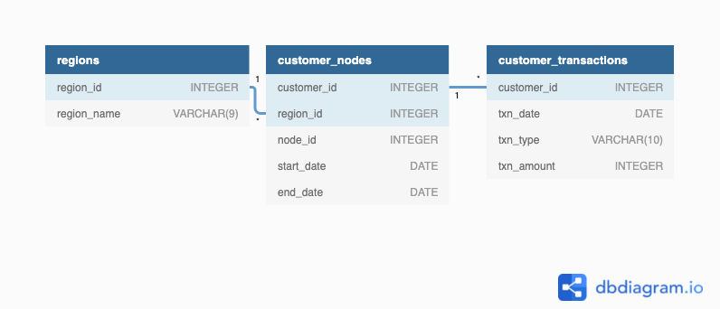

# Data-Bank - Case Study


# Context
There is a new innovation in the financial industry called Neo-Banks: new aged digital only banks without physical branches.

Danny thought that there should be some sort of intersection between these new age banks, cryptocurrency and the data world…so he decides to launch a new initiative - Data Bank!

Data Bank runs just like any other digital bank - but it isn’t only for banking activities, they also have the world’s most secure distributed data storage platform!

Customers are allocated cloud data storage limits which are directly linked to how much money they have in their accounts. There are a few interesting caveats that go with this business model, and this is where the Data Bank team need your help!

The management team at Data Bank want to increase their total customer base - but also need some help tracking just how much data storage their customers will need.

This case study is all about calculating metrics, growth and helping the business analyse their data in a smart way to better forecast and plan for their future developments!


#  Datasets
The Data Bank team have prepared a data model for this case study as well as a few example rows from the complete dataset below to get you familiar with their tables.

All of the required datasets for this case study reside within the data_bank schema on the PostgreSQL Docker setup.




`regions` table

Just like popular cryptocurrency platforms - Data Bank is also run off a network of nodes where both money and data is stored across the globe. In a traditional banking sense - you can think of these nodes as bank branches or stores that exist around the world.

This regions table contains the region_id and their respective region_name values

| region_id	 | region_name |
|------------|-------------|
| 1          | Africa      |
| 2          | America     |
| 3          | Asia        |
| 4          | Europe      |
| 5          | Oceania     | 


`customer_nodes` table

Customers are randomly distributed across the nodes according to their region - this also specifies exactly which node contains both their cash and data.

This random distribution changes frequently to reduce the risk of hackers getting into Data Bank’s system and stealing customer’s money and data!

Below is a sample of the top 10 rows of the data_bank.customer_nodes

|customer_id|region_id|node_id|start_date|end_date  |
|-----------|---------|-------|----------|----------|
|1          |3        |4      |2020-01-02|2020-01-03|
|2          |3        |5      |2020-01-03|2020-01-17|
|3          |5        |4      |2020-01-27|2020-02-18|
|4          |5        |4      |2020-01-07|2020-01-19|
|5          |3        |3      |2020-01-15|2020-01-23|
|6          |1        |1      |2020-01-11|2020-02-06|
|...        |...      |...    |...       |...       |


`customer_transactions` table

This table stores all customer deposits, withdrawals and purchases made using their Data Bank debit card.

|customer_id|txn_date  |txn_type|txn_amount|
|-----------|----------|--------|----------|
|429        |2020-01-21|deposit |82        |
|155        |2020-01-10|deposit |712       |
|398        |2020-01-01|deposit |196       |
|255        |2020-01-14|deposit |563       |
|185        |2020-01-29|deposit |626       |
|309        |2020-01-13|deposit |995       |
|...        |...       | ...    |...       |


# Case Study Questions
The following case study questions include some general data exploration analysis for the nodes and transactions before diving right into the core business questions and finishes with a challenging final request.


Before starting with the SQL queries however - I want to investigate the data
## Exploration
```sql
-- inspect data
SELECT 
   table_name, 
   column_name, 
   data_type 
FROM 
   information_schema.columns
WHERE 
   table_schema = 'data_bank'
ORDER BY table_name;

-- inspect  tables

SELECT
  *
FROM data_bank.customer_nodes
LIMIT
  20;

SELECT
  *
FROM
  data_bank.customer_transactions
LIMIT
  20;
  
SELECT
  *
FROM data_bank.regions
LIMIT
  20;

-- check customer_nodes table for duplicates 
WITH cte_duplicates AS(
    SELECT
      customer_id,
      region_id,
      node_id,
      start_date,
      end_date,
      COUNT(*) AS frequency
    FROM
      data_bank.customer_nodes
    GROUP BY
      customer_id,
      region_id,
      node_id,
      start_date,
      end_date
    ORDER BY
      frequency
  )
SELECT
  *
FROM
  cte_duplicates
WHERE
  frequency > 1;

-- check customer_transactions table for duplicates 
WITH cte_duplicates AS(
    SELECT
      customer_id,
      txn_date,
      txn_type,
      txn_amount,
      COUNT(*) AS frequency
    FROM
      data_bank.customer_transactions
    GROUP BY
      customer_id,
      txn_date,
      txn_type,
      txn_amount
    ORDER BY
      frequency
  )
SELECT
  *
FROM
  cte_duplicates
WHERE
  frequency > 1;

```

- there are no duplicates


## Customer Nodes Exploration
How many unique nodes are there on the Data Bank system?
```sql
--q1
WITH combinations AS (
SELECT DISTINCT
  node_id,
  region_id
FROM data_bank.customer_nodes
)
SELECT COUNT(*) FROM combinations;
```

- 25
What is the number of nodes per region?
```sql
SELECT
  region_name,
  COUNT(DISTINCT node_id)
FROM
  data_bank.customer_nodes AS nodes
JOIN data_bank.regions ON nodes.region_id = regions.region_id
GROUP BY
  region_name;
```
|region_name|count|
|-----------|-----|
|Africa     |5    |
|America    |5    |
|Asia       |5    |
|Australia  |5    |
|Europe     |5    |


How many customers are allocated to each region?
```sql
SELECT
  region_name,
  COUNT(DISTINCT customer_id)
FROM
  data_bank.customer_nodes AS nodes
JOIN data_bank.regions ON nodes.region_id = regions.region_id
GROUP BY
  region_name;
```

|region_name|count|
|-----------|-----|
|Africa     |102  |
|America    |105  |
|Asia       |95   |
|Australia  |110  |
|Europe     |88   |

How many days on average until  customers are reallocated to a different node?
```sql
-- q4
  WITH nodes_cte AS(
    SELECT
      customer_id,
      node_id,
      LEAD(node_id, 1, 0) OVER(
        PARTITION BY customer_id
        ORDER BY
          end_date DESC
      ) AS previous_node_id,
      start_date,
      end_date
    FROM
      data_bank.customer_nodes
    WHERE
      end_date != '9999-12-31'
  ),
  ranked_nodes AS(
    SELECT
      customer_id,
      node_id,
      previous_node_id,
      end_date - start_date AS duration
    FROM
      nodes_cte
    WHERE
      node_id != previous_node_id
  )
SELECT
  ROUND(AVG(duration))
FROM
  ranked_nodes;
```
-15
What is the median, 80th and 95th percentile for this same reallocation days metric for each region?
```sql
-- q5
  WITH nodes_cte AS(
    SELECT
      customer_id,
      region_id,
      node_id,
      LEAD(node_id, 1, 0) OVER(
        PARTITION BY customer_id
        ORDER BY
          end_date DESC
      ) AS previous_node_id,
      start_date,
      end_date
    FROM
      data_bank.customer_nodes
    WHERE
      end_date != '9999-12-31'
  ),
  ranked_nodes AS(
    SELECT
      customer_id,
      region_id,
      node_id,
      previous_node_id,
      end_date - start_date AS duration
    FROM
      nodes_cte
    WHERE
      node_id != previous_node_id
  )
SELECT
  region_name,
  PERCENTILE_CONT(0.5) WITHIN GROUP(
    ORDER BY
      duration
  ) AS median_allocation_duration,
  PERCENTILE_CONT(0.8) WITHIN GROUP(
    ORDER BY
      duration
  ) AS perc_80th_allocation_duration,
  PERCENTILE_CONT(0.95) WITHIN GROUP(
    ORDER BY
      duration
  ) AS perc_95th_allocation_duration
FROM
  ranked_nodes
  JOIN data_bank.regions ON regions.region_id = ranked_nodes.region_id
GROUP BY
  region_name;
```
|region_name|median_allocation_duration|perc_80th_allocation_duration|perc_95th_allocation_duration|
|-----------|--------------------------|-----------------------------|-----------------------------|
|Africa     |15                        |24                           |28                           |
|America    |15                        |23                           |27                           |
|Asia       |15                        |23                           |28                           |
|Australia  |15                        |24                           |28                           |
|Europe     |15                        |24                           |28                           |


## Customer Transactions

What is the unique count and total amount for each transaction type?
```sql
-- q6
SELECT
txn_type,
SUM(txn_amount) AS total_amount,
COUNT(*) AS num_txns
FROM data_bank.customer_transactions
GROUP BY txn_type;
```

|txn_type  |total_amount|num_txns|
|----------|------------|--------|
|purchase  |806537      |1617    |
|withdrawal|793003      |1580    |
|deposit   |1359168     |2671    |


What is the average total historical deposit counts and amounts for all customers?
```sql
--q7
  WITH deposit_by_customer AS(
    SELECT
      customer_id,
      SUM(txn_amount) AS total_amount_deposits,
      COUNT(*) AS num_deposits
    FROM
      data_bank.customer_transactions
    WHERE
      txn_type = 'deposit'
    GROUP BY
      customer_id
  )
SELECT
  ROUND(SUM(total_amount_deposits) / SUM(num_deposits)) AS avg_total_deposit,
  ROUND(AVG(num_deposits)) AS avg_num_deposits
FROM
  deposit_by_customer;
```

For each month - how many Data Bank customers make more than 1 deposit and at least either 1 purchase or 1 withdrawal in a single month?
```sql
 -- q8
WITH cte_month AS(
    SELECT
      DATE_TRUNC('MONTH', txn_date) AS txn_month,
      customer_id,
      SUM(
        CASE
          WHEN txn_type = 'deposit' THEN 1
          ELSE 0
        END
      ) AS num_deposits,
      SUM(
        CASE
          WHEN txn_type = 'withdrawal' THEN 1
          ELSE 0
        END
      ) AS num_withdrawals,
      SUM(
        CASE
          WHEN txn_type = 'purchase' THEN 1
          ELSE 0
        END
      ) AS num_purchases
    FROM
      data_bank.customer_transactions
    GROUP BY
      txn_month,
      customer_id
  )
SELECT
  txn_month,
  COUNT(customer_id)
FROM
  cte_month
WHERE
  num_deposits > 1
  AND (
    num_withdrawals >= 1
    OR num_purchases >= 1
  )
GROUP BY
  txn_month;
```

|txn_month|count|
|---------|-----|
|2020-04-01|70   |
|2020-03-01|192  |
|2020-01-01|168  |
|2020-02-01|181  |

What is the closing balance for each customer at the end of the month?
Comparing the closing balance of a customer’s first month and the closing balance from their second nth, what percentage of customers:
Have a negative first month balance?
Have a positive first month balance?
Increase their opening month’s positive closing balance by more than 5% in the following month?
Reduce their opening month’s positive closing balance by more than 5% in the following month?
Move from a positive balance in the first month to a negative balance in the second month?

